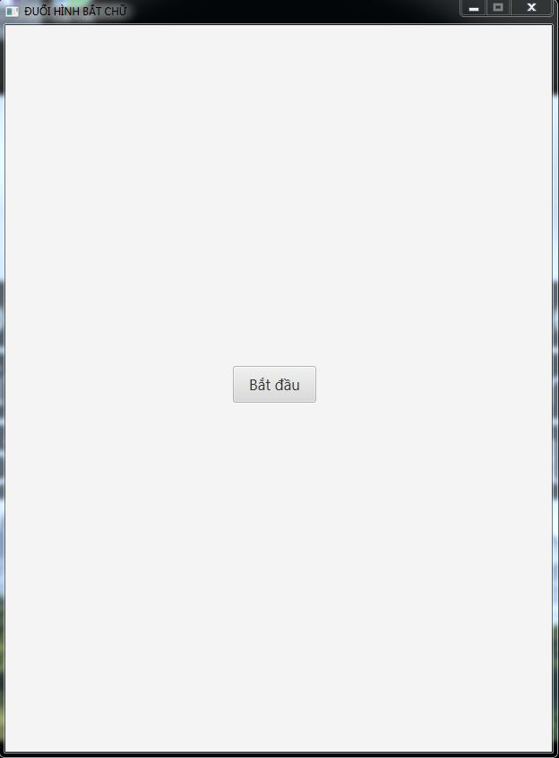
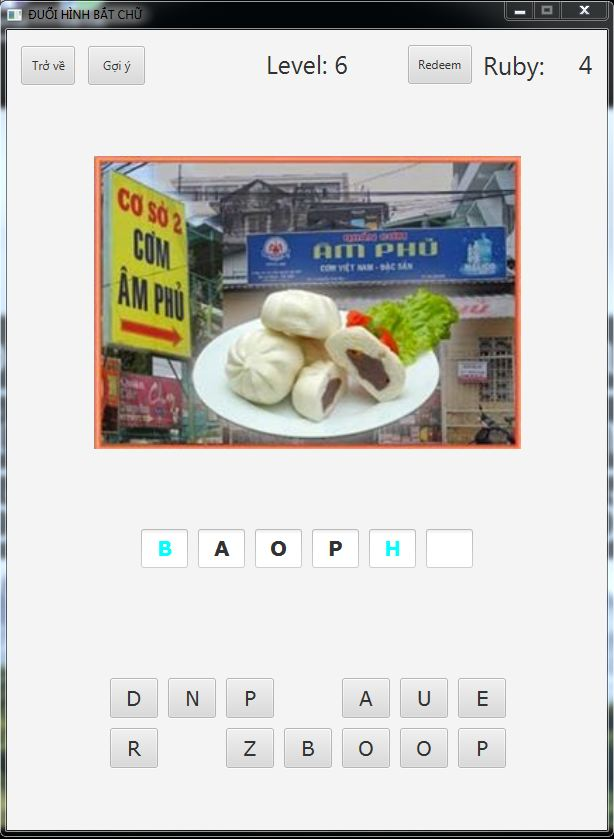
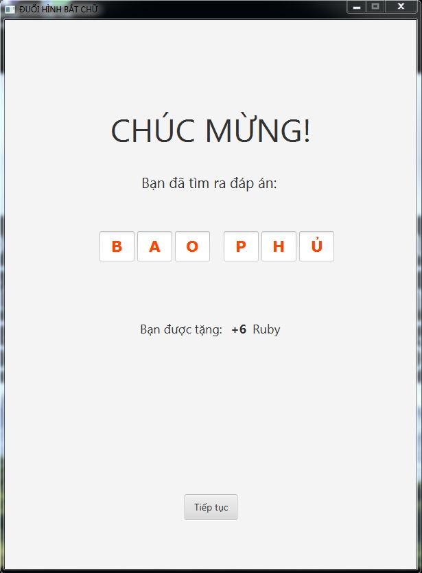
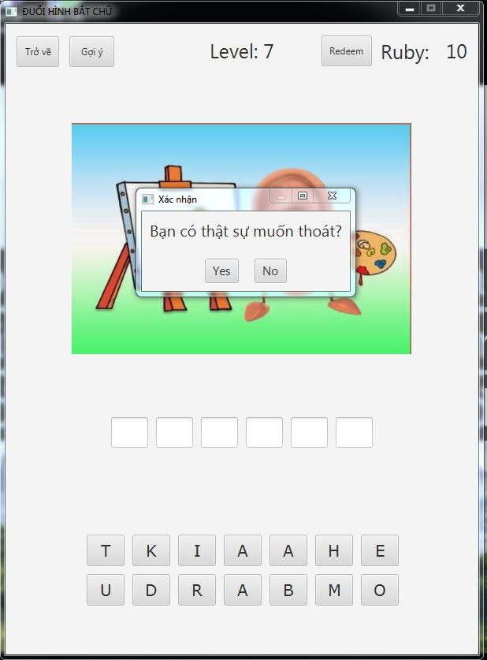

# Đuổi hình bắt chữ
(Redeem code: soundmax)

Game Đuổi hình bắt chữ

Sử dụng gợi ý

Đang chơi

Chúc mừng

Xác nhận thoát game

Những kỹ thuật sử dụng:
- Extend class
- Serializable/Deserializable
- Map
- Runnable
- Timer Task
- Thread
- FXML
- Scene builder
- Task class
- I/O
- Regex
